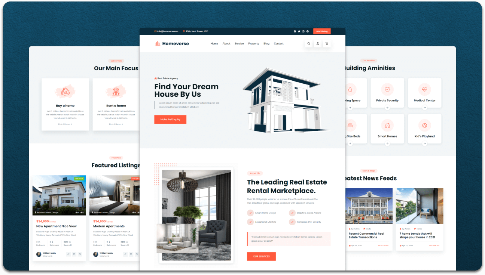
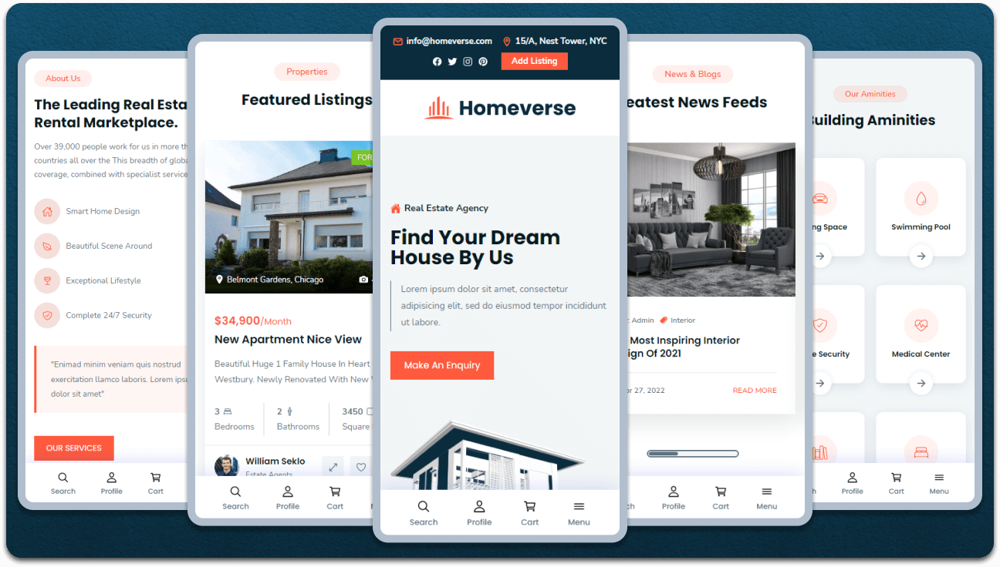

<div align="center">
  
  
  
  
  
  <br />
  <br />
  
  

  <h2 align="center">BBan - Clothing website</h2>

  BBan is a work in progress website <br /> built using HTML, CSS, and JavaScript.


  <a href="https://bban.netlify.app/"><strong>➥ Live Website</strong></a>


</div>

<br />

### Demo Screeshots




### Prerequisites

Before you begin, ensure you have met the following requirements:

* [Git](https://git-scm.com/downloads "Download Git") must be installed on your operating system.

### Run Website

Go To 

### Run Locally

To run **BBan** locally, run this command on your git bash:

Linux and macOS:

```bash
sudo git clone https://github.com/codewithsadee/homeverse.git
```

Windows:

```bash
git clone https://github.com/codewithsadee/homeverse.git
```

### Contact

If you want to contact with me you can reach me at [Email](mailto:bbanhelp@gmail.com).

### License

This project is, allowed to be remixed but please do not blatently copy